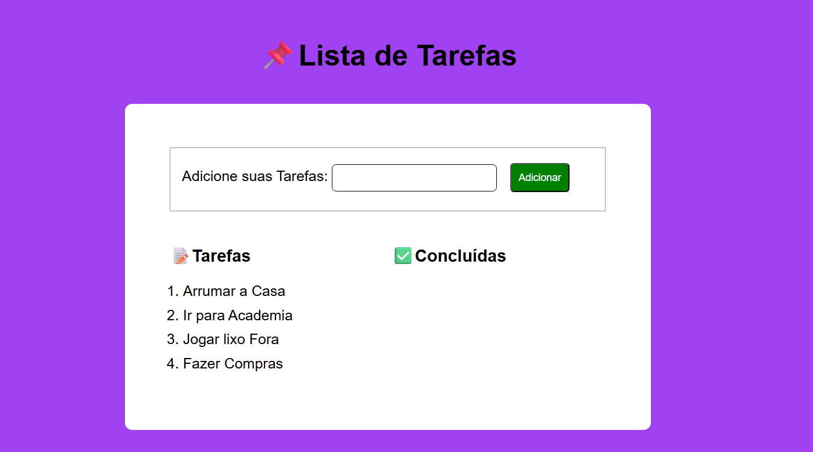

#  To-Do List

Aplicação de lista de tarefas desenvolvida com HTML, CSS e JavaScript, permitindo adicionar, remover e gerenciar tarefas de forma simples e interativa.

##  Funcionalidades -

- Adição de tarefas com data, mês e ano  
- Remoção de tarefas  
- Interface dinâmica com JavaScript  

##  Tecnologias -

- HTML  
- CSS  
- JavaScript  

##  Preview -

